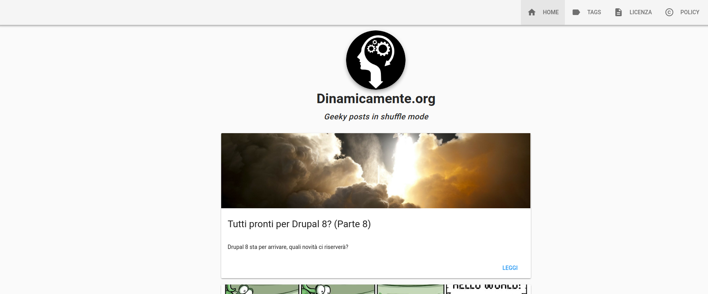
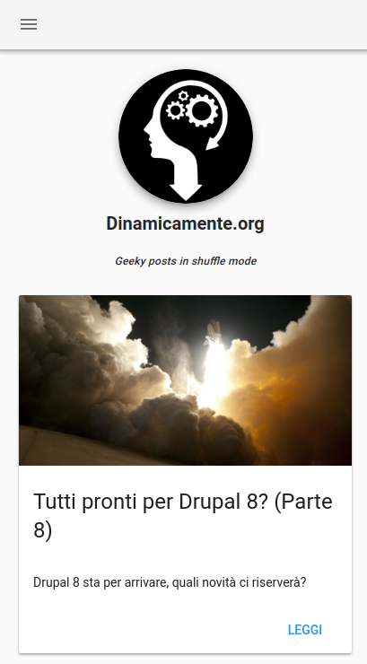

> Dinamicamente.org migration form Jekyll

## News! 
- 11/05/2019 *Updated to **nuxt 2.6.3** and **vuetify 1.5.14***

## Desktop preview



## Mobile preview



# Features
- [x] Markdown content for pages and posts with [Nuxt-Gustave](https://github.com/yann-yinn/nuxt-gustave) 
- [x] Highlight code inside posts with [Prismjs](http://prismjs.com/) ***(need fo fix!)***
- [x] Post shareable with social with [Vue Social Sharing](https://github.com/nicolasbeauvais/vue-social-sharing)
- [x] Cookie Law Compliant with [Vue Cookie Law](https://github.com/apertureless/vue-cookie-law)
- [x] Facebook Comments with [standard sdk](https://developers.facebook.com/docs/plugins/comments/)

# Prerequisite

[AVN](https://github.com/wbyoung/avn) - (optional) Automatic Version Switching for Node.js

# Awesome Modules

- [Vuetify](https://github.com/vuetifyjs/vuetify) - Material Design ROCKS!
- [Nuxt](https://github.com/nuxt/nuxt.js) - Generate static Site!
- [Ftp Deploy](https://github.com/simonh1000/ftp-deploy) - Deploy static site over FTP
- [Vue Moment](https://github.com/brockpetrie/vue-moment) - Parsing and filtering date faster

# Build Setup

``` bash
# install dependencies
$ npm install # Or yarn install

# serve with hot reload at localhost:3000
$ npm run dev

# build for production and launch server
$ npm run build
$ npm start

# generate static project
$ npm run generate

# generate static project and test locally with http-server module
$ npm run generate:dev
```
**NOTE:** [Nuxtent](https://github.com/nuxt-community/nuxtent-module) was dismissed due [incompatibility](https://github.com/nuxt-community/nuxtent-module/issues/190) with new releases of Nuxt

For detailed explanation on how things work, check out the [Nuxt.js](https://github.com/nuxt/nuxt.js) and [Vuetify.js](https://vuetifyjs.com/) documentation.
